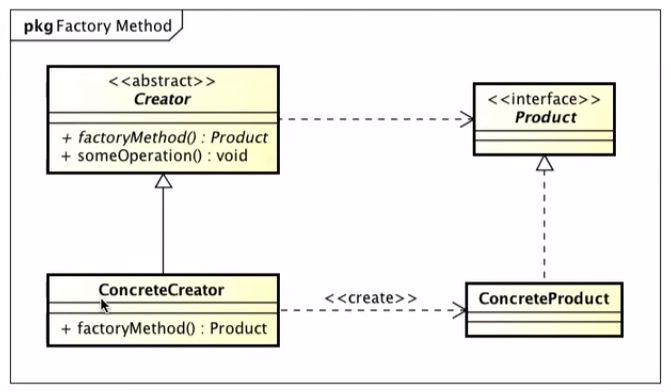

# Principais Design Patterns Aplicados com Java

Estudo dos principais Design Patterns Aplicados com Java em acompanhamento ao curso da Algaworks.

## Factory Method

"O Padrão **Factory Method** define uma interface para criar um objeto, mas permite que as classes que implementam a interface decidam qual classe instanciar.
O Factory Method permite uma classe delegar a instanciação a subclasse." (Gang Of Four)

O diagrama abaixo representa o padrão Factory Method. A classe *Creator* tem contato apenas com a *interface Product*, não sabe como cria um produto concreto. A subclasse de Creator é que conhece como criar um objeto através da implementação da interface *Product*.

No nosso exemplo implementamos em MalaDiretaLib a classe abstrata [MalaDireta](maladireta-lib/src/main/java/com/algaworks/maladireta/MalaDireta.java) como abstração para o *Creator* e a interface [ContatoRepository](maladireta-lib/src/main/java/com/algaworks/contato/ContatoRepository.java)/Contatos como abstração para *Product* no diagrama anterior. 
As subclasses [MalaDiretaCSV](maladireta-cliente/src/main/java/com/algaworks/maladireta/csv/MalaDiretaCSV.java) e [MalaDiretaXML](maladireta-cliente/src/main/java/com/algaworks/maladireta/xml/MalaDiretaXML.java) ficam responsáveis por importar uma implementação e instanciação de um ContatoRepository.  

As subclasses de Contatos (ContatoRepository) ficam com a responsabilidade de criação da lista de objetos Contatos. 

 

<b>Classe Abstrata *vs* Interface</b>
Basicamente, além de outras diferenças: a classe abstrata pode conter implementações e a interface apenas definições.
Uma classe pode implementar múltiplas interfaces, mas estender apenas uma classe abstrata.
A classe abstrata é uma calsse, não traz relação "*é um*". Classe abstrata pode conter construtor, a interface não.

### Notes
Para adicionar um projeto local como dependência em outro projeto no Intellij siga os passos descritos em https://www.jetbrains.com/help/idea/working-with-module-dependencies.html#add-a-new-dependency.
