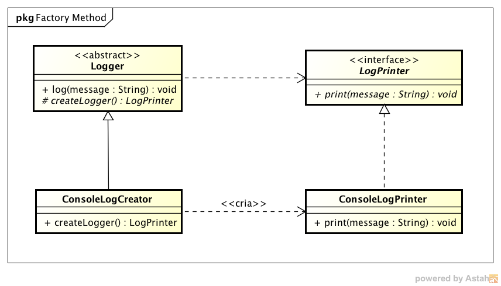

# Desafio Factory Method



## Desafio proposto:

Para esse exercício vamos treinar sua habilidade de abstração para criar um framework para gerar logs em várias saídas
possíveis, por exemplo console ou um arquivo. Claro que você como um excelente programador que conhece orientação a
objetos, na verdade mais do que isso, conhece como criar um bom projeto orientado a objetos usando os design patterns,
não irá criar um código acoplado e difícil de estender, mas sim um código desacoplado e extensível.

Vamos descrever um pouco do que gostaríamos que nosso framework tenha para facilitar a vida de quem for utilizá-lo.

Em uma classe que precise gerar logs, receber um objeto do tipo Logger com o método abaixo:
> public void log(String message)

Por exemplo, uma classe chamada CalculadoraDeImpostos, que no método calcular, irá imprimir o valor calculado:

```java
public class CalculadoraDeImpostos {

    private Logger logger;

    public CalculadoraDeImpostos(Logger logger) {
        this.logger = logger;
    }

    public void calcular(double valor) {
// Aqui teria uma lógica para calcular impostos sobre o valor passado

        // no fim, o programador gostaria de deixar registrado o valor calculado
        logger.log("Imposto calculado para o valor R$" + valor);
    }

}
```

Veja bem, essa é uma classe de exemplo, um cliente do nosso framework. O seu trabalho é criar todas as
classes/interfaces que serão usadas para criar esse objeto logger e passar a uma classe de exemplo, como a acima.

Alguns requisitos importantes:

 - Antes de cada mensagem de log, deve ser impresso o dia e hora atuais 
 - O framework deve ser extensível para vários tipos
de saída (console, arquivo txt, xml, etc)

Crie também um diagrama de classe para mostrar como seu framework funciona.